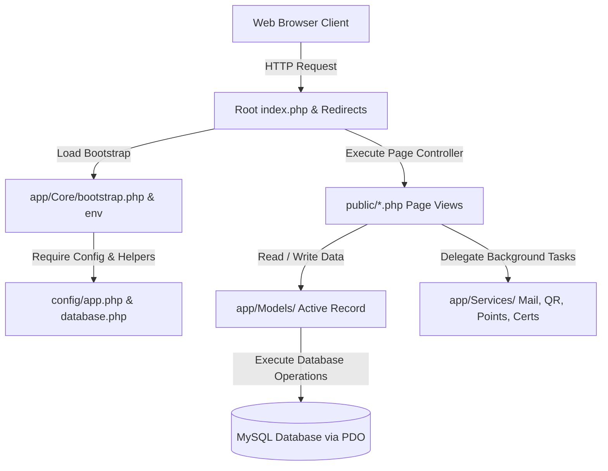
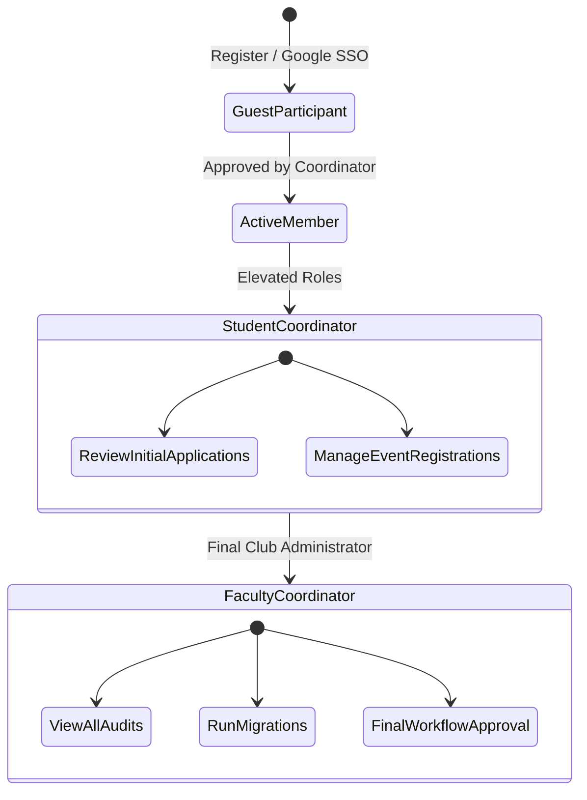

# 🏗️ CyberKavach System Architecture

This document details the software design, system flow, database structure, and security controls built into the **CyberKavach Smart Club Management System**.

---

## 🗺️ 1. High-Level Architecture Flow

CyberKavach utilizes a lightweight, zero-dependency MVC (Model-View-Controller) structure using strict-typed native PHP. This ensures rapid loading speeds and full compatibility with standard web hosting environments.



---

## 📂 2. Directory Layout & Routing Logic

The application divides security contexts clearly between what the public can request vs. where the core operational logic sits:

```text
CYBERKAVACH/
├── app/                  # Secure Application Layer (Blocked via .htaccess)
│   ├── Core/             # App initialization, database connection, env loaders
│   ├── Helpers/          # Utility functions (nav highlighting, HTML sanitization)
│   ├── Middleware/       # Security headers, CSRF, and HTTP context rules
│   ├── Models/           # Database Active-Record classes
│   ├── Services/         # Modular business services (QR, Mail, Certificates)
│   └── Views/            # Dashboard layout panels, alerts, and navigation links
├── config/               # App & DB configurations (Blocked via .htaccess)
├── database/             # Migrations logs, seeds, and compiled schema.sql
├── public/               # Web Accessible root
│   ├── assets/           # Premium Vanilla CSS layouts, scripts, and brand logos
│   ├── uploads/          # Event posters, QR codes, and certificate files
│   └── *.php             # Entry page controllers (login, dashboards, verification)
```

---

## 🔑 3. Multi-Level Role Governance

CyberKavach uses a strict Role-Based Access Control (RBAC) hierarchy. Users are gated to specific dashboard consoles:



---

## 🛡️ 4. Security Hardening Layer

To secure credentials, personal information, and digital awards, the platform enforces the following core safety protocols:

### A. Cryptographic Integrity Check
Every digital certificate generated features a SHA-256 cryptographic signature constructed with a private key:
$$\text{Signature} = \text{HMAC-SHA256}(\text{Certificate Code} \parallel \text{Name} \parallel \text{Email}, \text{Secret Key})$$

When verified on the portal, it uses constant-time string comparison (`hash_equals`) to mitigate **Timing-Attack** probing.

### B. SQL Injection Mitigation
Direct query strings are strictly forbidden. All operations utilize **PDO prepared queries** with strict parameter bindings:
```php
$stmt = db()->prepare("SELECT * FROM users WHERE email = :email LIMIT 1");
$stmt->execute(['email' => $email]);
```

### C. Session Hijacking Protection
Every session is locked dynamically to the user's IP Address and User Agent on login:
```php
if ($_SESSION['_client_ip'] !== client_ip() || $_SESSION['_client_ua'] !== user_agent()) {
    session_destroy(); // Instantly flag and terminate hijacked session cookies
}
```

---

## 📊 5. Operational Analytics & Logs

* **Oversight Audit Logs**: Tracks critical database mutations by recording the `old_values` and `new_values` as JSON blocks alongside actor IDs, client IP addresses, and User Agents.
* **Performance Indicators**: Analytics dashboards pull real-time counts, check-in completion percentages, late-arrival rates, and workload statistics directly from transaction tables.
