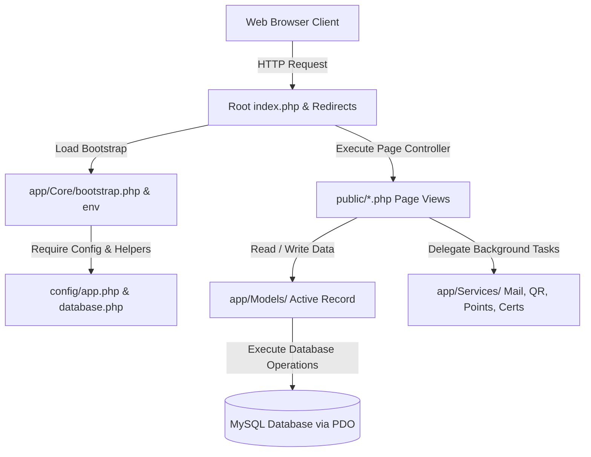
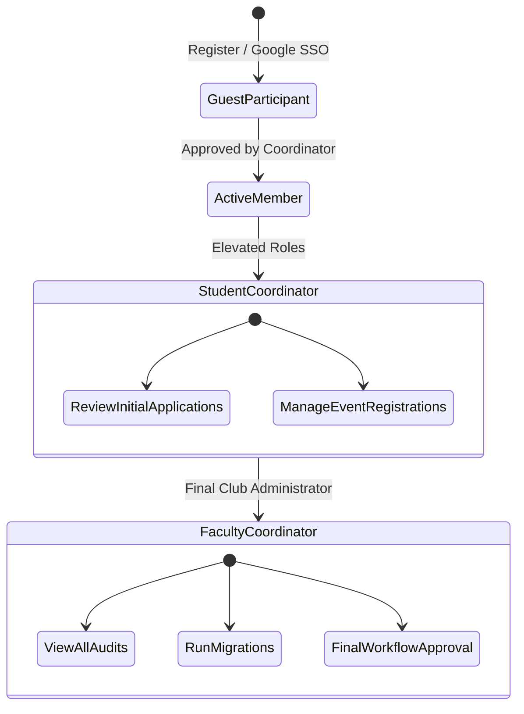

# 🏗️ System Architecture & Module Guide

This document details the software design, database relationships, and system flows implemented across all 6 core modules of the CyberKavach platform.

---

## 🗺️ 1. High-Level Architecture Flow

CyberKavach utilizes a lightweight, zero-dependency MVC (Model-View-Controller) structure using strict-typed native PHP.

### Access Control Hierarchy
Users transition between roles, accessing gated dashboards as they are verified and approved:

---

## 🏆 2. Core Modules Implemented

### 🔐 Module 1 — Auth & Approvals
* **Production Google SSO**: Complete auth flow via Google accounts.
* **Google Auth Sandbox**: Developer sandbox console simulating role login profiles (`faculty_coordinator`, `student_coordinator`, `tech_coordinator`, `club_member`) without requiring live keys.
* **Polymorphic Approvals**: Multi-step authorization mapping (Student Coordinator review &rarr; Faculty Coordinator final approval) for accounts, events, budget allocations, and venue booking.

### 📜 Module 2 — Certificate System
* **GD Template Composer**: Renders participant names and details dynamically onto vector template graphics.
* **Verification Portal**: Public verification page checks signatures via constant-time strings comparison (`hash_equals`) and applies client rate-limiting.

### 📅 Module 3 — Event & Team Management
* **Registrations**: Set registration deadlines, participant capacities, team limits, and upload posters.
* **Saved Teams**: Members can save custom teams (e.g., "CyberSentinels") for fast single-click event registration.

### ⏱️ Module 4 — Attendance Check-In/Out
* **QR Camera Scanner**: Real-time scanner powered by HTML5-QRCode reads check-in codes instantly.
* **Punctuality Audit**: Flags late arrivals and early exits automatically based on custom timeline parameters.

### 🏆 Module 5 — Points & Recognition
* **Appreciation Ledger**: Automatically awards +15 points for check-in and penalizes late arrivals or early exits (-5 points).
* **Badge Unlock**: Milestones automatically trigger progression badges (*Novice*, *Dedicated*, *Cyber Sentinel*, *Elite*).
* **Rewards Shop**: Row-level transaction locks (`FOR UPDATE`) protect point redemptions against double-spending attacks.

### 📊 Module 6 — Analytics & Settings
* **Metrics Consoles**: CSS gauges displaying registration rates, check-in averages, and workload metrics.
* **Oversight Audit Logs**: Tracks model mutations recording before-and-after JSON configurations along with IP addresses and user agents.
