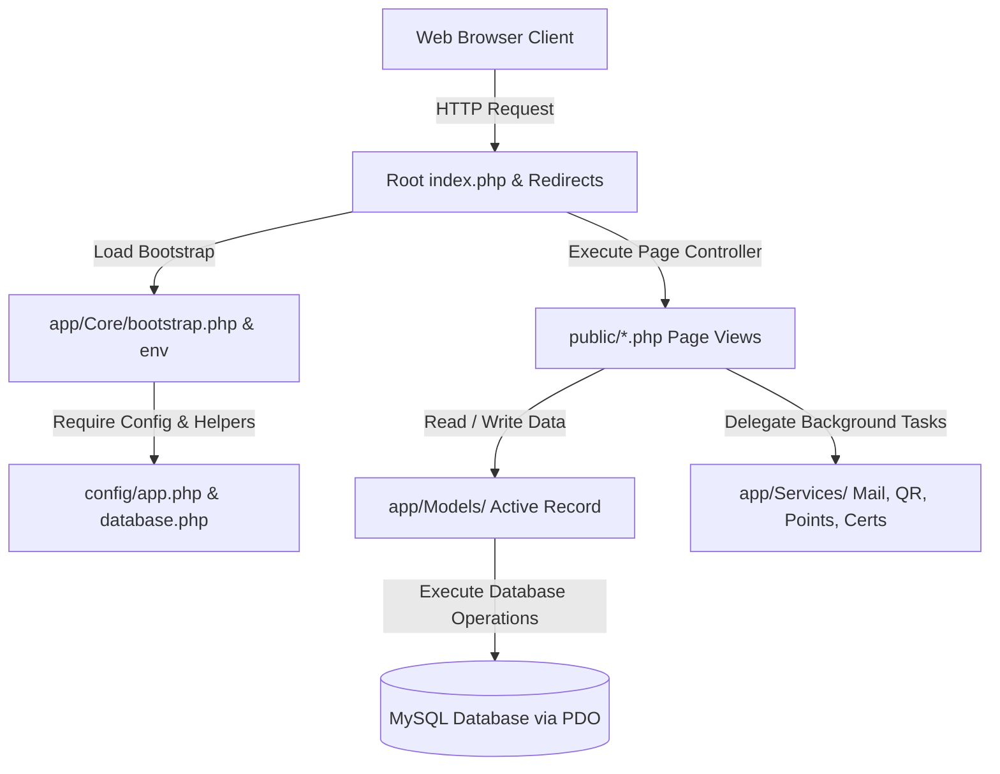
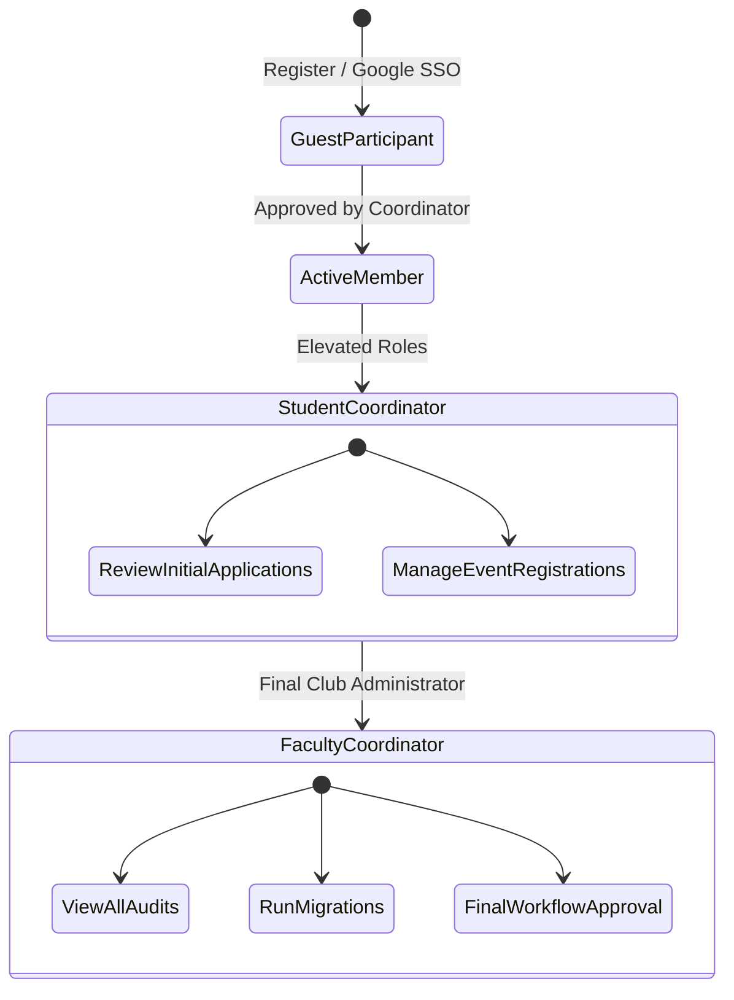

<p align="center" style="background-color: #102a43; padding: 24px; border-radius: 8px;">
  
</p>

<p align="center">
  <strong>Smart Club Management System with Multi-Level Governance & Appreciation Ledger</strong>
</p>

<p align="center">
  <strong>📘 Documentation Guides:</strong>
  <a href="#live-deployment">🚀 Live Deployment</a> •
  <a href="#system-architecture">🏗️ System Architecture</a> •
  <a href="#feature-showcase-by-module">🏆 Feature Showcase</a>
</p>

<p align="center">
  <strong>🔗 Quick Links:</strong>
  <a href="#key-features">Key Features</a> •
  <a href="#tech-stack">Tech Stack</a> •
  <a href="#installation-setup">Setup Guide</a> •
  <a href="#auth-sandbox">Auth Sandbox</a> •
  <a href="#security-architecture">Security Details</a>
</p>

<p align="center">
  <strong>🤝 Community & Policy:</strong>
  <a href="CONTRIBUTING.md">Contributing Guidelines</a> •
  <a href="SUPPORT.md">Get Support</a> •
  <a href="SECURITY.md">Security Policy</a>
</p>
---

## <a id="introduction"></a>🌟 Introduction

**CyberKavach** is an enterprise-grade Smart Club Management System designed for educational institutions and community clubs. It features a robust multi-level approval workflow, smart certificate rendering with tamper-proof cryptographic verification, gamified reward points appreciation mechanics, active check-in logs, and live operational analytics.

Designed with a clean, creative typographic wordmark brand header asset (`public/assets/images/logo.png`) that gives a premium identity to the platform portal.

---

## <a id="key-features"></a>🚀 Key Features

### 🔐 1. Multi-Level Approval Engine
* **Hierarchical Workflows**: Supports budget approvals, venue reservations, content drafts, and social media posting requests.
* **Role Gating**: Multi-step authorization mapping (Student Coordinator review &rarr; Faculty Coordinator final approval).
* **Auto-Escalations**: Background engine (`escalate.php`) checks for requests idle beyond threshold hours and alerts coordinators.
* **Email Alerts**: Automatic emails notify submitters on submission, review transitions, returns, and approvals.

### 📜 2. Cryptographic Certificate System
* **GD Vector Rendering**: Dynamic participant template composition using PHP GD.
* **Anti-Forgery Verification**: Every certificate features a cryptographic signature calculated as:
  `HMAC-SHA256(code || name || email, secret_key)`
* **Timing-Attack Defenses**: Uses constant-time string comparison (`hash_equals`) to verify signatures.
* **Rate Limiting**: Sessions are protected by request limiting (max 30 searches per 10 mins).

### 🏆 3. Reward Points & Leaderboard
* **Attendance Checking Integration**: Auto-allocates points (+15 pts base, with -5 pts penalties for late arrivals or early exits).
* **Milestone Badges**: Automatically unlocks progression achievements (*Novice*, *Dedicated*, *Cyber Sentinel*).
* **Double-Spending Prevention**: Uses database transaction row-level locking (`FOR UPDATE`) for secure prize redemptions.

### 📊 4. Live Analytics & Audit Oversight
* **Analytics Console**: Responsive HTML/CSS metrics panels displaying registration dynamics, check-in percentages, and coordinator workload counts.
* **Audit logs Console**: Tracks actions with IP address details, user agents, and value modifications (Before &rarr; After JSON blocks).

---

## <a id="tech-stack"></a>🛠️ Tech Stack

<p align="center">
  
  
  
  
  
</p>

* **Backend**: Native PHP (Strict types, custom modular routing)
* **Frontend**: Vanilla CSS Layouts (Responsive developer framework, zero external heavy CSS templates)
* **Database**: MySQL / MariaDB via PDO (Prepared queries)
* **Email Service**: Raw Socket SMTP handler / Local Logger in Development Mode.
* **Check-In Scanning**: Frontend HTML5-QRCode scanner module.

---

## <a id="directory-structure"></a>📁 Directory Structure

```text
CYBERKAVACH/
├── app/                  # Core PHP Application Logic
│   ├── Core/             # Bootstrapping, routing, and database helpers
│   ├── Helpers/          # Global helper functions (navigation, sanitization)
│   ├── Middleware/       # Security headers and CORS configuration
│   ├── Models/           # Database Active-Record models
│   ├── Services/         # Services (Mail, OTP, Certificates, QR code)
│   └── Views/            # HTML template views and dashboard panels
├── config/               # Application & database config files
├── database/             # Seeding files, migration SQL scripts, and schema.sql
├── public/               # Publicly accessible web root
│   ├── assets/           # Stylesheets, scripts, brand logo assets
│   ├── uploads/          # Generated QR codes, certs, and event posters
│   └── *.php             # Core entry point page controllers
├── storage/              # Private application storage (logs, temp records)
└── .env.example          # Environment template configuration
```

---

## <a id="system-architecture"></a>🏗️ System Architecture

### High-Level Request Flow
The system processes client requests via index page controllers, validating configurations, and executing active record operations communicating with MySQL databases via PDO.



### Access Control Hierarchy
Users transition between roles, accessing gated dashboards as they are verified and approved:



---

## <a id="feature-showcase-by-module"></a>🏆 Feature Showcase by Module

### 🔐 Module 1 — Auth & Approvals
* **Production Google SSO**: Complete auth flow via Google accounts.
* **Google Auth Sandbox**: Developer sandbox console simulating role login profiles (`faculty_coordinator`, `student_coordinator`, `tech_coordinator`, `club_member`) without requiring live keys.
* **Polymorphic Approvals**: Multi-step authorization mapping (Student Coordinator review &rarr; Faculty Coordinator final approval) for accounts, events, budget allocations, and venue booking.

### 📜 Module 2 — Certificate System
* **GD Template Composer**: Renders participant names and details dynamically onto vector template graphics.
* **Verification Portal**: Public verification page checks signatures via constant-time strings comparison (`hash_equals`) and applies client rate-limiting.

### 📅 Module 3 — Event & Team Management
* **Registrations**: Set registration deadlines, participant capacities, team limits, and upload posters.
* **Saved Teams**: Members can save custom teams (e.g., "CyberSentinels") for fast single-click event registration.

### ⏱️ Module 4 — Attendance Check-In/Out
* **QR Camera Scanner**: Real-time scanner powered by HTML5-QRCode reads check-in codes instantly.
* **Punctuality Audit**: Flags late arrivals and early exits automatically based on custom timeline parameters.

### 🏆 Module 5 — Points & Recognition
* **Appreciation Ledger**: Automatically awards +15 points for check-in and penalizes late arrivals or early exits (-5 points).
* **Badge Unlock**: Milestones automatically trigger progression badges (*Novice*, *Dedicated*, *Cyber Sentinel*, *Elite*).
* **Rewards Shop**: Row-level transaction locks (`FOR UPDATE`) protect point redemptions against double-spending attacks.

### 📊 Module 6 — Analytics & Settings
* **Metrics Consoles**: CSS gauges displaying registration rates, check-in averages, and workload metrics.
* **Oversight Audit Logs**: Tracks model mutations recording before-and-after JSON configurations along with IP addresses and user agents.

---

## <a id="installation-setup"></a>💾 Installation & Setup


### 📋 Prerequisites
* XAMPP / WampServer (PHP 8.1+ with GD and cURL extensions enabled)
* MySQL / MariaDB database server

### ⚙️ Steps

1. **Clone the Repository** (Move it into your local document root, e.g., `htdocs/CYBERKAVACH`).
   ```bash
   git clone https://github.com/dharmit-dev/CYBERKAVACH.git
   ```

2. **Configure Environment variables**
   Copy `.env.example` to `.env` and adjust the variables:
   ```bash
   cp .env.example .env
   ```

3. **Import Database Migrations**
   Setup a MySQL database named `cyberkavach`. You can import the unified [schema.sql](database/schema.sql) file directly into phpMyAdmin or run the SQL script via your CLI.


4. **Start local Server**
   Start Apache and MySQL from the XAMPP Control Panel. Open the browser and visit:
   `http://localhost/CYBERKAVACH/`

---

## <a id="live-deployment"></a>🚀 Live Deployment Guide (InfinityFree)

To deploy CyberKavach securely inside a public `/htdocs` folder where outside folder creation is restricted:

### 📤 1. Upload Project Files
Upload the entire project root (`app/`, `config/`, `database/`, `public/`, `storage/`, `.env`, `.htaccess`, `index.php`) inside the `/htdocs` folder using your Web File Manager (Monsta FTP). Do **not** upload the `vendor` folder; the system automatically falls back to its built-in zero-dependency code library.

### ⚙️ 2. Configure Environment (`.env`)
Double-click your online `.env` file and configure it as follows:
```ini
APP_NAME="CyberKavach Club"
APP_ENV=production
APP_URL=https://yourdomain.infinityfreeapp.com/public    # <-- Must include /public
APP_DEBUG=false

DB_HOST=sqlXXX.infinityfree.com                           # <-- Copy from MySQL Databases cPanel
DB_PORT=3306
DB_DATABASE=if0_XXXXXXXX_cyberkavach
DB_USERNAME=if0_XXXXXXXX
DB_PASSWORD=your_mysql_password
DB_CHARSET=utf8mb4

# SMTP Gmail configuration
MAIL_FROM_ADDRESS=your-gmail@gmail.com
MAIL_FROM_NAME="CyberKavach Club"
MAIL_HOST=smtp.gmail.com
MAIL_PORT=587
MAIL_USERNAME=your-gmail@gmail.com
MAIL_PASSWORD=your-google-app-password                   # <-- 16-character App Password

# Google OAuth Keys
GOOGLE_CLIENT_ID=your-google-client-id.apps.googleusercontent.com
GOOGLE_CLIENT_SECRET=your-google-client-secret
```

### 🔒 3. Align Google Redirect URI
In the Google Cloud Console, update your authorized redirect URI to:
`https://yourdomain.infinityfreeapp.com/public/auth/google-callback.php`

---


## <a id="auth-sandbox"></a>🔑 Google Auth Sandbox (SSO)

If `GOOGLE_CLIENT_ID` is empty in `.env`, clicking **Sign in with Google** redirects to the developer **Google Auth Sandbox**.

<p align="center">
  <kbd>
    
  </kbd>
</p>

* **Existing Members**: Click any listed user profile (Faculty, Student, Tech) to sign in instantly.
* **New Registrations**: Input a custom email and name. The callback provisions a verified, active `guest_participant` profile and logs the browser in instantly.

---

## <a id="security-architecture"></a>🛡️ Security Architecture

* **SQL Injection**: Prevented using strict PDO prepared statements.
* **Cross-Site Scripting (XSS)**: Mitigated by HTML escaping values via `h()`.
* **CSRF Mitigation**: Enforces unique transaction state validation on OAuth redirections and token input headers on form submissions.
* **Session Safety**: Configures native PHP session cookies with `HttpOnly`, `SameSite=Lax`, and `Secure` flags.

---

<p align="center">
  Made with 🛡️ for CyberKavach.
</p>
