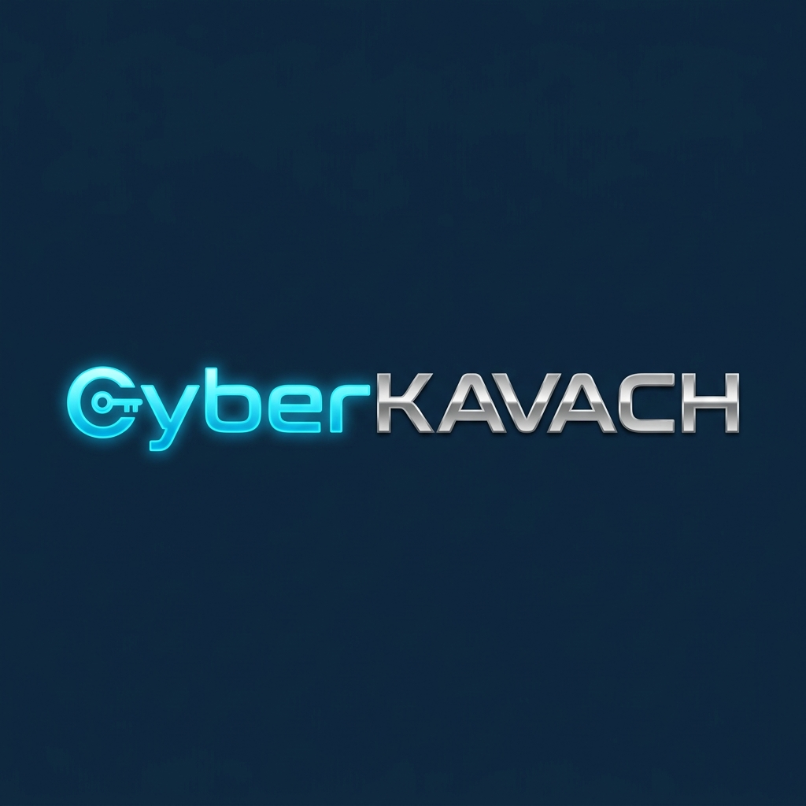

<p align="center">
  
</p>

<h1 align="center">🛡️ CyberKavach 🛡️</h1>

<p align="center">
  <strong>Smart Club Management System with Multi-Level Governance & Appreciation Ledger</strong>
</p>

<p align="center">
  <a href="#-key-features">Features</a> •
  <a href="#-tech-stack">Tech Stack</a> •
  <a href="#-installation--setup">Setup</a> •
  <a href="#-sso-sandbox">SSO Sandbox</a> •
  <a href="#-security-architecture">Security</a>
</p>

---

## 🌟 Introduction

**CyberKavach** is an enterprise-grade Smart Club Management System designed for educational institutions and community clubs. It features a robust multi-level approval workflow, smart certificate rendering with tamper-proof cryptographic verification, gamified reward points appreciation mechanics, active check-in logs, and live operational analytics.

---

## 🚀 Key Features

### 🔐 1. Multi-Level Approval Engine
* **Hierarchical Workflows**: Supports budget approvals, venue reservations, content drafts, and social media posting requests.
* **Role Gating**: Multi-step authorization mapping (Student Coordinator review &rarr; Faculty Coordinator final approval).
* **Auto-Escalations**: Background engine (`escalate.php`) checks for requests idle beyond threshold hours and alerts coordinators.
* **Email Alerts**: Automatic emails notify submitters on submission, review transitions, returns, and approvals.

### 📜 2. Cryptographic Certificate System
* **GD Vector Rendering**: Dynamic participant template composition using PHP GD.
* **Anti-Forgery Verification**: Every certificate features a cryptographic signature calculated as:
  `HMAC-SHA256(code || name || email, secret_key)`
* **Timing-Attack Defenses**: Uses constant-time string comparison (`hash_equals`) to verify signatures.
* **Rate Limiting**: Sessions are protected by request limiting (max 30 searches per 10 mins).

### 🏆 3. Reward Points & Leaderboard
* **Attendance Checking Integration**: Auto-allocates points (+15 pts base, with -5 pts penalties for late arrivals or early exits).
* **Milestone Badges**: Automatically unlocks progression achievements (*Novice*, *Dedicated*, *Cyber Sentinel*).
* **Double-Spending Prevention**: Uses database transaction row-level locking (`FOR UPDATE`) for secure prize redemptions.

### 📊 4. Live Analytics & Audit Oversight
* **Analytics Console**: Responsive HTML/CSS metrics panels displaying registration dynamics, check-in percentages, and coordinator workload counts.
* **Audit logs Console**: Tracks actions with IP address details, user agents, and value modifications (Before &rarr; After JSON blocks).

---

## 🛠️ Tech Stack

<p align="center">
  
  
  
  
  
</p>

* **Backend**: Native PHP (Strict types, custom modular routing)
* **Frontend**: Vanilla CSS Layouts (Responsive developer framework, zero external heavy CSS templates)
* **Database**: MySQL / MariaDB via PDO (Prepared queries)
* **Email Service**: Raw Socket SMTP handler / Local Logger in Development Mode.
* **Check-In Scanning**: Frontend HTML5-QRCode scanner module.

---

## 💾 Installation & Setup

### 📋 Prerequisites
* XAMPP / WampServer (PHP 7.4+ or PHP 8.0+ with GD and cURL extensions enabled)
* MySQL / MariaDB database server

### ⚙️ Steps

1. **Clone the Repository** (Move it into your local document root, e.g., `htdocs/CYBERKAVACH`).
   ```bash
   git clone https://github.com/dharmit-dev/CYBERKAVACH.git
   ```

2. **Configure Environment variables**
   Copy `.env.example` to `.env` and adjust the variables:
   ```bash
   cp .env.example .env
   ```

3. **Import Database Migrations**
   Setup a MySQL database named `cyberkavach`. You can import SQL migrations sequentially from `database/migrations/` or run the database seeder:
   ```bash
   php database/migrations/run_all.php
   ```

4. **Start local Server**
   Start Apache and MySQL from the XAMPP Control Panel. Open the browser and visit:
   `http://localhost/CYBERKAVACH/`

---

## 🔑 Google Auth Sandbox (SSO)

If `GOOGLE_CLIENT_ID` is empty in `.env`, clicking **Sign in with Google** redirects to the developer **Google Auth Sandbox**.

<p align="center">
  <kbd>
    
  </kbd>
</p>

* **Existing Members**: Click any listed user profile (Faculty, Student, Tech) to sign in instantly.
* **New Registrations**: Input a custom email and name. The callback provisions a verified, active `guest_participant` profile and logs the browser in instantly.

---

## 🛡️ Security Architecture

* **SQL Injection**: Prevented using strict PDO prepared statements.
* **Cross-Site Scripting (XSS)**: Mitigated by HTML escaping values via `h()`.
* **CSRF Mitigation**: Enforces unique transaction state validation on OAuth redirections and token input headers on form submissions.
* **Session Safety**: Configures native PHP session cookies with `HttpOnly`, `SameSite=Lax`, and `Secure` flags.

---

<p align="center">
  Made with 🛡️ for CyberKavach.
</p>
